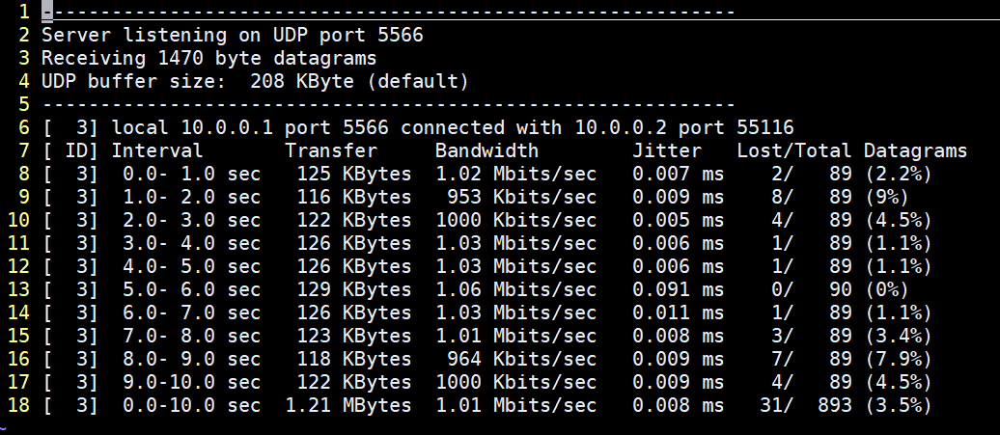
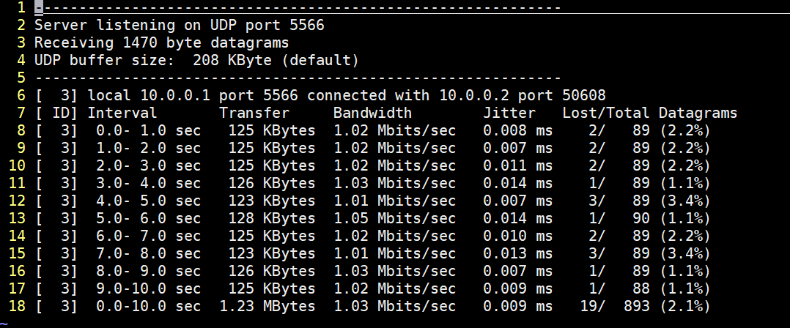

# Route Configuration

This repository is a lab for NCTU course "Introduction to Computer Networks 2018".

---
## Abstract

In this lab, we are going to write a Python program with Ryu SDN framework to build a simple software-defined network and compare the different between two forwarding rules.

---
## Objectives

1. Learn how to build a simple software-defined networking with Ryu SDN framework
2. Learn how to add forwarding rule into each OpenFlow switch

---
## Execution

> TODO:
> * How to run your program?
    Open two terminal, run topo.py
    $ [sudo] mn --custom topo.py --topo topo --link tc --controller remote
    in one terminal, then run controller.py
    $ [sudo] ryu-manager controller.py –observe-links
    in the other terminal
    
> * What is the meaning of the executing command (both Mininet and Ryu controller)?
    About the above command line of Mininet:
    "--custom" means read custom classes or parameters from .py file
    "--topo" determines the topology we want
    "--link" determines the link we want
    "--controller" determines the controller we want. In this lab, we type remote because we want use Ryu.
    About the above command of Ryu:
    "ryu-manager" is the executable for Ryu applications
    "--observe-links" observe link discovery events.
    
> * Show the screenshot of using iPerf command in Mininet (both `SimpleController.py` and `controller.py`)
    SimpleController.py
    
    controller.py
    

---
## Description

### Tasks

> TODO:
> * Describe how you finish this work in detail

1. Environment Setup
   (1.) click https://classroom.github.com/a/RHNMq4Td and join this lab
   
   (2.) use a toolbox for remote computing( I use MobaXterm) to connect to the container
        
        * IP address : 140.113.195.69
        
        * Port : 10119
        
        * user : root
        
        * Password : cn2018 ( after logining, I change the passwd to 0410119)
    
   (3.) clone GitHub repository
    
        $ git clone https://github.com/nctucn/lab3-julie200420.git Route_Configuration
         
   (4.) Run Mininet for testing
   
        $ [sudo] mn
       
2. Example of Ryu SDN
   (1.) Go to the /scr directory and run SimpleTopo.py 
   
        $ cd /root/Route_Configuration/src/
        
        $ [sudo] mn --custom SimpleTopo.py --topo topo --link tc --controller remote
        
   (2.) Open another terminal and login the same container
   
   (3.) Go to the /scr directory and run SimpleController.py
        
        $ cd /root/Route_Configuration/src/
        
        $ [sudo] ryu-manager SimpleController.py --observelinks
        
   (4.) exit the program
        
        in the terminal runnning SimpleTopo.py
        mininet> exit
        
        in the terminal running SimpleController.py
        Ctrl-z
        $ mn -c
        to make sure that RTNETLINK is clean

3. Mininet Topology

4. Ryu Controller

5. Measurement

### Discussion

> TODO:
> * Answer the following questions

1. Describe the difference between packet-in and packet-out in detail.
   packet-in : a controller receives a packet from a switch, so a controller can receive information
   packet-out : a controller sends a packets to a switch to tell a switch how to transfer packets
   
2. What is “table-miss” in SDN?
   If a packet doesn't find a match flow entry in flow table, we call "table-miss".
   
3. Why is "`(app_manager.RyuApp)`" adding after the declaration of class in `controller.py`?
   
4. Explain the following code in `controller.py`.
    ```python
    @set_ev_cls(ofp_event.EventOFPPacketIn, CONFIG_DISPATCHER)
    ```

5. What is the meaning of “datapath” in `controller.py`?
   
6. Why need to set "`ip_proto=17`" in the flow entry?
   
7. Compare the differences between the iPerf results of `SimpleController.py` and `controller.py` in detail.
   
8. Which forwarding rule is better? Why?

---
## References

> TODO: 
> * Please add your references in the following

* **Ryu SDN**
    * [Ryubook Documentation](https://osrg.github.io/ryu-book/en/html/)
    * [Ryubook [PDF]](https://osrg.github.io/ryu-book/en/Ryubook.pdf)
    * [Ryu 4.30 Documentation](https://github.com/mininet/mininet/wiki/Introduction-to-Mininet)
    * [Ryu Controller Tutorial](http://sdnhub.org/tutorials/ryu/)
    * [OpenFlow 1.3 Switch Specification](https://www.opennetworking.org/wp-content/uploads/2014/10/openflow-spec-v1.3.0.pdf)
    * [Ryubook 說明文件](https://osrg.github.io/ryu-book/zh_tw/html/)
    * [GitHub - Ryu Controller 教學專案](https://github.com/OSE-Lab/Learning-SDN/blob/master/Controller/Ryu/README.md)
    * [Ryu SDN 指南 – Pengfei Ni](https://feisky.gitbooks.io/sdn/sdn/ryu.html)
    * [OpenFlow 通訊協定](https://osrg.github.io/ryu-book/zh_tw/html/openflow_protocol.html)
    * [Ubuntu Manpage: ryu-manager - management for Ryu application](http://manpages.ubuntu.com/manpages/bionic/man8/ryu-manager.8.html)
* **Python**
    * [Python 2.7.15 Standard Library](https://docs.python.org/2/library/index.html)
    * [Python Tutorial - Tutorialspoint](https://www.tutorialspoint.com/python/)
* **Mininet**
    * [Mininet Walkthrough](http://mininet.org/walkthrough/)
* **Others**
    * [Cheat Sheet of Markdown Syntax](https://www.markdownguide.org/cheat-sheet)
    * [Vim Tutorial – Tutorialspoint](https://www.tutorialspoint.com/vim/index.htm)
    * [鳥哥的 Linux 私房菜 – 第九章、vim 程式編輯器](http://linux.vbird.org/linux_basic/0310vi.php)
    * [CasonChan - OpenFlow Switch学习笔记(三)——Flow Tables](https://www.cnblogs.com/CasonChan/p/4620652.html)

---
## Contributors

> TODO:
> * Please replace "`YOUR_NAME`" and "`YOUR_GITHUB_LINK`" into yours

* [YOUR_NAME](YOUR_GITHUB_LINK)
* [David Lu](https://github.com/yungshenglu)

---
## License

GNU GENERAL PUBLIC LICENSE Version 3
